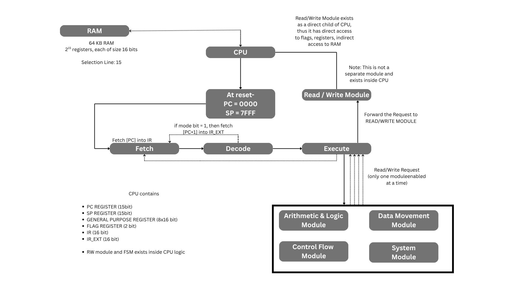
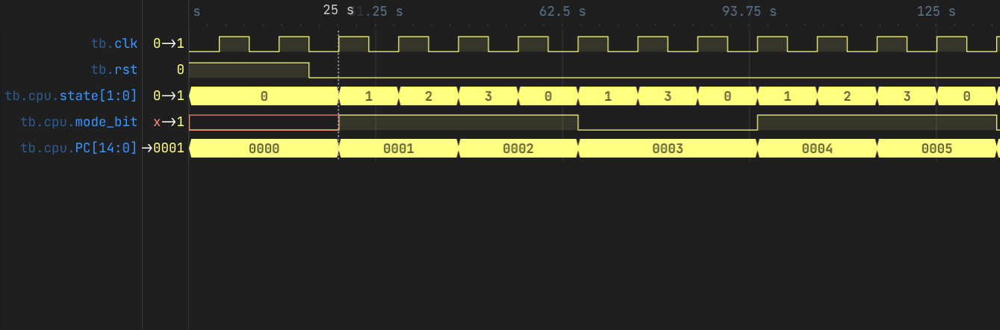
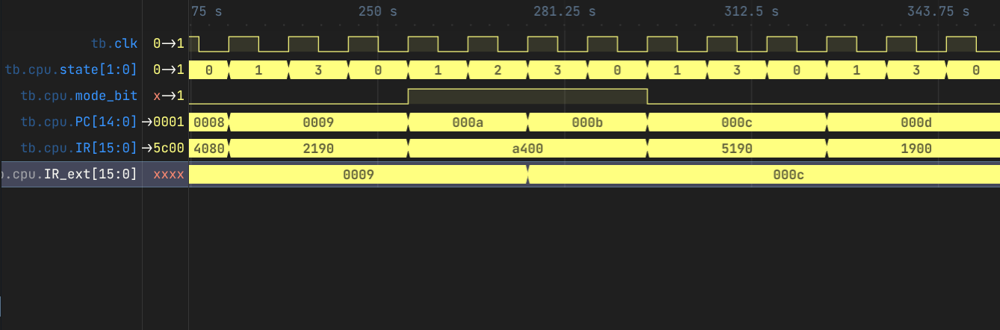

# SYNTH-16 Custom 16-Bit Processor

SYNTH-16 is a custom 16-bit microprocessor designed and implemented in Verilog. The processor follows a variable-length instruction set architecture (VL-ISA), supports a multi-cycle finite state machine for instruction execution, and includes a complete software toolchain consisting of a custom assembler, automated testing framework, and simulation environment.

The processor is organized into independent execution modules responsible for arithmetic, data movement, control flow, and system operations. Instructions are assembled using a custom Python assembler and executed on a word-addressable memory system. The project is intended as an end-to-end implementation of a simple processor, covering instruction set design, control logic, memory interface, assembler development, and verification through simulation.

---

## Documentation

Detailed documentation for each execution module is available below.

* [Arithmetic Module](docs/arithmetic_module_documentation.md)
* [Data Movement Module](docs/data_movement_documentation.md)
* [Control Flow Module](docs/control_flow_documentation.md)
* [System Module](docs/system_module_documentation.md)

---


# Architecture

<p align="center">
    
</p>

SYNTH-16 follows a modular architecture built around a centralized CPU core. The CPU communicates with a shared RAM through a dedicated Read/Write module and dispatches instructions to one of four execution modules.

The architecture consists of:

* CPU Core
* Register File (R0–R7)
* Program Counter (PC)
* Stack Pointer (SP)
* FLAGS Register
* Instruction Register (IR)
* Instruction Extension Register (IR_EXT)
* Read/Write Module
* Arithmetic Module
* Data Movement Module
* Control Flow Module
* System Module
* Word-addressable RAM

Although every execution module continuously receives the decoded instruction and processor state, only one module is enabled during the **EXECUTE** state. The selected module generates the required control signals while all other modules remain inactive.

The processor implements a **16-bit data path** and accesses memory using a **16-bit address space**. Instructions may occupy either one or two memory words depending on whether an extension word is required.

---

## Processor Specifications

| Parameter                 | Value               |
| ------------------------- | ------------------- |
| Data Width                | 16 bits             |
| Address Width             | 16 bits             |
| Instruction Width         | 16 bits             |
| Memory Model              | Von Neumann         |
| RAM Capacity              | 64 KB               |
| Program Counter           | 16 bits             |
| Stack Pointer             | 16 bits             |
| General Purpose Registers | 8 (R0–R7)           |
| Flags                     | Zero (Z), Carry (C) |
| Instruction Set           | Variable-Length ISA |
| Execution Model           | Multi-State FSM     |

---

## CPU Components

| Component                                   | Description                                                                                      |
| ------------------------------------------- | ------------------------------------------------------------------------------------------------ |
| **Register File**                           | Eight 16-bit general purpose registers used by arithmetic, memory, and control instructions.     |
| **Program Counter (PC)**                    | Holds the address of the next instruction to be fetched.                                         |
| **Stack Pointer (SP)**                      | Points to the top of the hardware stack used by subroutine instructions.                         |
| **Instruction Register (IR)**               | Stores the currently executing instruction word.                                                 |
| **Instruction Extension Register (IR_EXT)** | Stores the second instruction word for instructions requiring an immediate value or address.     |
| **FLAGS Register**                          | Contains the Zero and Carry status flags.                                                        |
| **Read/Write Module**                       | Interfaces the processor with RAM for instruction fetches and data transfers.                    |
| **Execution Modules**                       | Perform arithmetic, data movement, control flow, and system operations under control of the FSM. |

---

## Memory Organization

The processor uses a unified Von Neumann memory model where instructions, data, and the stack share the same address space.

| Address Range | Purpose        | Size  |
| ------------- | -------------- | ----- |
| `0000 - 7FFF` | Program Region | 32 KB |
| `8000 - EFFF` | Data Region    | 28 KB |
| `F000 - FFFF` | Stack Region   | 4 KB  |

The Program Region and Data Region are software-defined logical partitions. Hardware does not enforce these boundaries.

The Stack Region is managed by the Stack Pointer (SP). Stack operations performed by `INVOKE` and `RETURN` automatically update the Stack Pointer, with the stack growing downward from address `FFFF`.

## Instruction Execution

SYNTH-16 executes instructions using a multi-state finite state machine (FSM). Depending on the instruction format, an instruction may occupy either one or two memory words.

Instructions that do not require an immediate operand are completed using three states, while instructions containing a 16-bit immediate value or branch target require an additional instruction fetch.

### Standard Instruction Flow

Instructions that occupy a single memory word follow the execution sequence shown below.

```text
FETCH
   ↓
DECODE
   ↓
EXECUTE
```

During these states:

| State       | Operation                                                                                                |
| ----------- | -------------------------------------------------------------------------------------------------------- |
| **FETCH**   | Read the instruction from memory into the Instruction Register (`IR`) and increment the Program Counter. |
| **DECODE**  | Decode the opcode and determine the execution module responsible for the instruction.                    |
| **EXECUTE** | Execute the instruction and update registers, memory, flags, or the Program Counter as required.         |

---

### Extended Instruction Flow

Instructions requiring a 16-bit immediate value or address occupy two memory words.

These instructions execute as

```text
FETCH
   ↓
DECODE
   ↓
FETCH_EXT
   ↓
EXECUTE
```

The additional **FETCH_EXT** state retrieves the second instruction word before execution begins.

---

# Entering the FETCH_EXT State

During the **DECODE** state, the instruction decoder examines the **mode bit** contained in the instruction word.

* **mode_bit = 0**

  * Instruction length is one word.
  * The processor transitions directly to **EXECUTE**.

* **mode_bit = 1**

  * Instruction length is two words.
  * The processor enters the **FETCH_EXT** state.
  * The current value of the Program Counter already points to the extension word.

<p align="center">
    
</p>

In the waveform above,

1. The instruction is fetched into **IR**.
2. During **DECODE**, the instruction's **mode bit** is evaluated.
3. Since the mode bit is asserted, the finite state machine transitions to **FETCH_EXT** instead of **EXECUTE**.
4. The Program Counter already references the second instruction word in memory.

---

# FETCH_EXT Operation

The purpose of the **FETCH_EXT** state is to fetch the extension word required by variable-length instructions.

During this state the processor performs two operations simultaneously.

```text
IR_EXT <= RAM[PC]
PC     <= PC + 1
```

<p align="center">
    
</p>

The waveform illustrates the following sequence:

* The processor enters the **FETCH_EXT** state.
* The current Program Counter points to the extension word.
* The memory interface reads `RAM[PC]`.
* The fetched value is stored in the **Instruction Extension Register (`IR_EXT`)**.
* The Program Counter increments to the next instruction address.
* On the following clock cycle, the finite state machine transitions into the **EXECUTE** state.

This mechanism allows SYNTH-16 to support 16-bit immediates and absolute addresses without increasing the size of every instruction.

---

# Instruction Formats

SYNTH-16 supports three instruction formats.

### Register-Type (R-Type)

Register instructions perform operations using operands stored entirely within the register file.

```
15          11 10  9   7 6   4 3         0
+-------------+---+-----+-----+-----------+
|   Opcode    | M | Rd  | Rs  |  Unused   |
+-------------+---+-----+-----+-----------+
```

Used by:

* SUMMON
* SEAL
* MIRROR
* FUSE
* DRAIN
* AND
* OR
* XOR
* JUDGE

---

### Immediate-Type (I-Type)

Immediate instructions require an additional instruction word when the mode bit is asserted.

```
Word 1

15          11 10  9   7 6   4 3         0
+-------------+---+-----+-----+-----------+
|   Opcode    | M | Rd  | --  |  Imm[3:0] |
+-------------+---+-----+-----+-----------+

Word 2 (IR_EXT)

15                                     0
+---------------------------------------+
|          Immediate / Address          |
+---------------------------------------+
```

Used by:

* ENCHANT
* SHL
* SHR

---

### Branch-Type (B-Type)

Branch instructions store their destination address inside the extension word.

```
Word 1

15          11 10
+-------------+---+
|   Opcode    | M |
+-------------+---+

Word 2 (IR_EXT)

15                                     0
+---------------------------------------+
|          Target Address               |
+---------------------------------------+
```

Used by:

* WARP
* WARPZ
* WARPNZ
* WARPC
* WARPNC
* INVOKE

The `RETURN`, `IDLE`, and `FREEZE` instructions do not require an extension word and therefore execute using the standard instruction flow.


# Instruction Set Reference

The SYNTH-16 instruction set consists of **24 instructions** grouped into four categories: Data Movement, Arithmetic & Logic, Control Flow, and System Instructions.

| Category               | Mnemonic  | Syntax              | Semantics                                |
| ---------------------- | --------- | ------------------- | ---------------------------------------- |
| **Data Movement**      | `SUMMON`  | `SUMMON Rd, Rs`     | `Rd ← MEM[R[Rs]]`                        |
|                        | `SEAL`    | `SEAL Rd, Rs`       | `MEM[R[Rd]] ← R[Rs]`                     |
|                        | `MIRROR`  | `MIRROR Rd, Rs`     | `Rd ← Rs`                                |
|                        | `ENCHANT` | `ENCHANT Rd, Imm16` | `Rd ← Imm16`                             |
| **Arithmetic & Logic** | `FUSE`    | `FUSE Rd, Rs`       | `Rd ← Rd + Rs`                           |
|                        | `DRAIN`   | `DRAIN Rd, Rs`      | `Rd ← Rd - Rs`                           |
|                        | `RISE`    | `RISE Rd`           | `Rd ← Rd + 1`                            |
|                        | `FALL`    | `FALL Rd`           | `Rd ← Rd - 1`                            |
|                        | `AND`     | `AND Rd, Rs`        | `Rd ← Rd AND Rs`                         |
|                        | `OR`      | `OR Rd, Rs`         | `Rd ← Rd OR Rs`                          |
|                        | `XOR`     | `XOR Rd, Rs`        | `Rd ← Rd XOR Rs`                         |
|                        | `NOT`     | `NOT Rd`            | `Rd ← NOT Rd`                            |
|                        | `SHL`     | `SHL Rd, Imm`       | `Rd ← Rd << Imm`                         |
|                        | `SHR`     | `SHR Rd, Imm`       | `Rd ← Rd >> Imm`                         |
|                        | `JUDGE`   | `JUDGE Rd, Rs`      | Compare `Rd` and `Rs`; update FLAGS only |
| **Control Flow**       | `WARP`    | `WARP addr`         | Unconditional jump                       |
|                        | `WARPZ`   | `WARPZ addr`        | Jump if Zero flag is set                 |
|                        | `WARPNZ`  | `WARPNZ addr`       | Jump if Zero flag is clear               |
|                        | `WARPC`   | `WARPC addr`        | Jump if Carry flag is set                |
|                        | `WARPNC`  | `WARPNC addr`       | Jump if Carry flag is clear              |
|                        | `INVOKE`  | `INVOKE addr`       | Push return address and jump             |
|                        | `RETURN`  | `RETURN`            | Pop return address into Program Counter  |
| **System**             | `IDLE`    | `IDLE`              | No operation                             |
|                        | `FREEZE`  | `FREEZE`            | Halt processor execution                 |

---

# Status Flags

The processor maintains two status flags.

| Flag          | Description                                                                                  |
| ------------- | -------------------------------------------------------------------------------------------- |
| **Z (Zero)**  | Set when an operation produces a result equal to zero.                                       |
| **C (Carry)** | Set on arithmetic carry, borrow, or when a shift operation shifts a bit out of the register. |

The behaviour of each instruction with respect to the FLAGS register is summarized below.

| Instruction | Z                        | C                    |
| ----------- | ------------------------ | -------------------- |
| SUMMON      | —                        | —                    |
| SEAL        | —                        | —                    |
| MIRROR      | —                        | —                    |
| ENCHANT     | Set if immediate is zero | —                    |
| FUSE        | Updated                  | Updated              |
| DRAIN       | Updated                  | Updated              |
| RISE        | Updated                  | —                    |
| FALL        | Updated                  | Updated on underflow |
| AND         | Updated                  | —                    |
| OR          | Updated                  | —                    |
| XOR         | Updated                  | —                    |
| NOT         | Updated                  | —                    |
| SHL         | Updated                  | Last bit shifted out |
| SHR         | Updated                  | Last bit shifted out |
| JUDGE       | Updated                  | Updated              |
| WARP        | —                        | —                    |
| WARPZ       | —                        | —                    |
| WARPNZ      | —                        | —                    |
| WARPC       | —                        | —                    |
| WARPNC      | —                        | —                    |
| INVOKE      | —                        | —                    |
| RETURN      | —                        | —                    |
| IDLE        | —                        | —                    |
| FREEZE      | —                        | —                    |

---

# Supported Instruction Categories

### Data Movement

These instructions transfer data between registers, memory, and immediate values.

* SUMMON
* SEAL
* MIRROR
* ENCHANT

---

### Arithmetic and Logic

These instructions perform arithmetic, logical, comparison, and bit-manipulation operations.

* FUSE
* DRAIN
* RISE
* FALL
* AND
* OR
* XOR
* NOT
* SHL
* SHR
* JUDGE

---

### Control Flow

These instructions modify the Program Counter and implement branching and subroutine calls.

* WARP
* WARPZ
* WARPNZ
* WARPC
* WARPNC
* INVOKE
* RETURN

---

### System Instructions

These instructions control processor execution.

* IDLE
* FREEZE


# Testing

The repository includes a collection of assembly programs designed to verify the functionality of individual instructions as well as complete processor workflows.

All assembly source files and their corresponding Verilog testbenches are located inside the `programs/` directory.

Each testbench automatically:

* Instantiates the processor.
* Loads the assembled program into RAM.
* Applies reset and clock signals.
* Waits until the processor executes the `FREEZE` instruction.
* Displays the final output.
* Optionally generates a VCD waveform for GTKWave.

---

# Running Simulations

## Automated Execution

The recommended method for executing test programs is through the provided automation script.

```bash
python tester.py
```

After launching the script, enter the desired program number when prompted.

The script automatically performs the following steps:

1. Copies the selected assembly program and testbench into the project root.
2. Invokes the assembler to generate machine code.
3. Compiles the complete processor using Icarus Verilog.
4. Executes the simulation.
5. Displays the output produced by the testbench.

---

## Manual Execution

### Step 1 — Copy the desired program

Copy the required assembly program and its corresponding testbench to the project root.

```bash
cp programs/prog12.asm test.asm
cp programs/prog12_tb.v testbench.v
```

---

### Step 2 — Assemble the program

Generate the machine code used by the processor.

```bash
python assembler.py
```

This produces:

```
program.hex
program.bin
```

`program.hex` is loaded into RAM during simulation.

---

### Step 3 — Compile the processor

Compile the complete processor and the selected testbench using Icarus Verilog.

```bash
iverilog \
testbench.v \
cpu_top.v \
ram.v \
execution_unit.v \
arithmetic_module.v \
data_movement_module.v \
control_flow_module.v \
system_module.v
```

This generates the simulation executable (`a.out`).

---

### Step 4 — Execute the simulation

Run the compiled design.

```bash
vvp a.out
```

The simulation continues until either

* the processor executes the `FREEZE` instruction, or
* the timeout defined by the testbench is reached.

---

## Viewing Waveforms

Most testbenches support waveform generation through the standard VCD format.

```verilog
initial begin
    $dumpfile("waves.vcd");
    $dumpvars(0, testbench);
end
```

After simulation completes, open the waveform using GTKWave.

```bash
gtkwave waves.vcd
```

The waveform can be used to inspect:

* Finite State Machine transitions
* Program Counter updates
* Register File contents
* FLAGS register
* RAM interface
* Instruction Register (`IR`)
* Instruction Extension Register (`IR_EXT`)
* Control signals generated by each execution module

---

# Software Toolchain

The processor is accompanied by a custom software toolchain used during development and verification.

| Tool           | Purpose                                                        |
| -------------- | -------------------------------------------------------------- |
| `assembler.py` | Converts SYNTH-16 assembly programs into machine code.         |
| `tester.py`    | Automates assembling, compiling, and simulating test programs. |
| `opcodes.json` | Defines opcode encodings used by the assembler.                |
| `aliases.json` | Maps standard instruction names to SYNTH-16 magical mnemonics. |

---

# Project Highlights

* Custom 16-bit processor implemented entirely in Verilog.
* Variable-Length Instruction Set Architecture (VL-ISA).
* Multi-cycle finite state machine controller.
* Modular execution units for arithmetic, memory, control flow, and system operations.
* Custom Python assembler.
* Automated simulation framework.
* Word-addressable unified memory architecture.
* Hardware stack supporting subroutine calls and returns.
* Synthesizable FPGA design.
